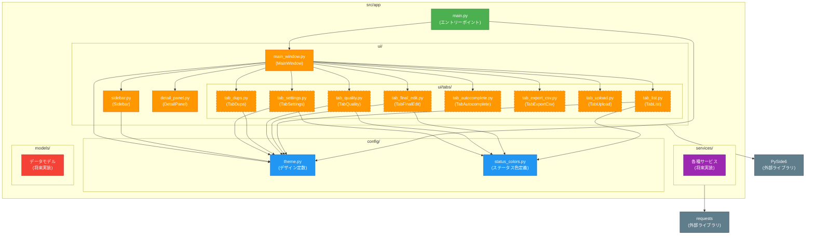
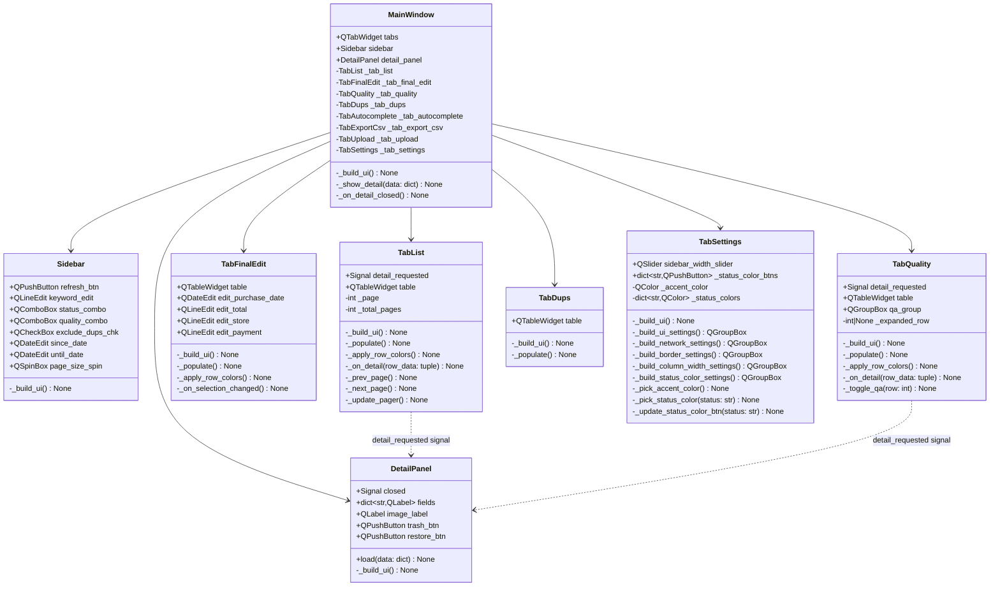
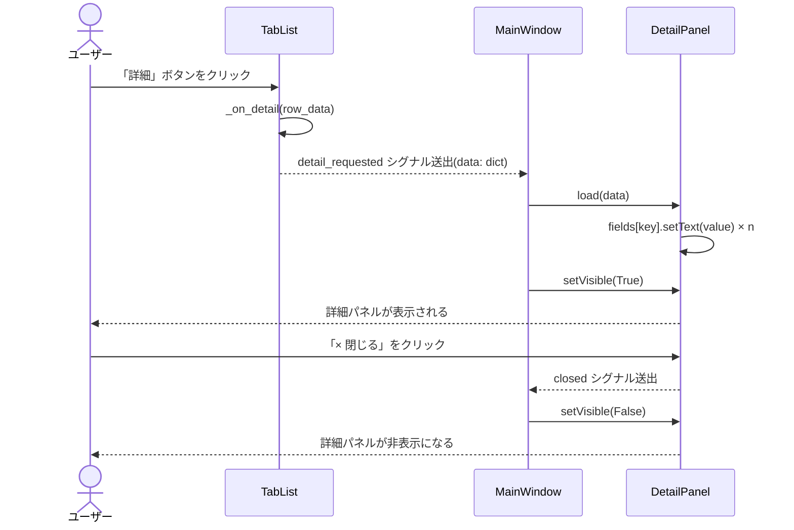
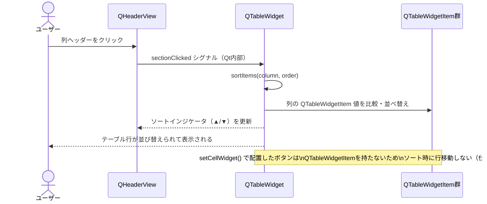
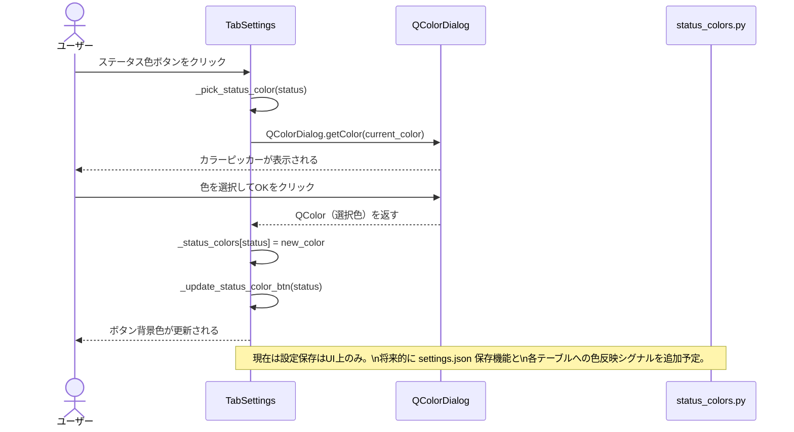
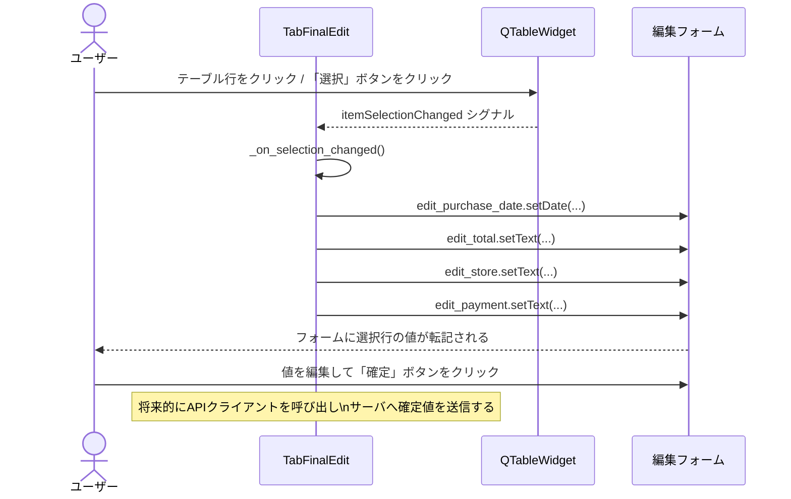
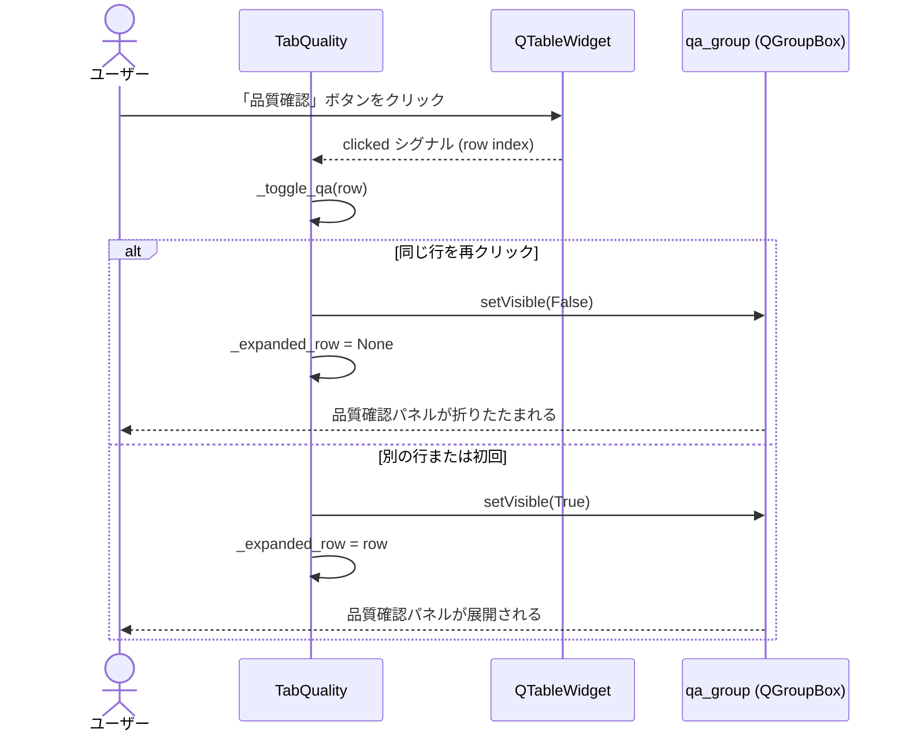

# アーキテクチャ設計ドキュメント

## 1. パッケージ構成・クラス図（ハイブリッド）

### 1-1. 全体パッケージ図

### 1-2. UIクラス詳細図

---

## 2. 各パッケージ・クラスの責務解説

### `main.py` — エントリーポイント

| 項目 | 内容 |
|------|------|
| 責務 | アプリケーションの起動。`QApplication` の初期化、グローバルスタイルシート・フォントの適用、`MainWindow` の生成と表示を行う。 |
| 外部依存 | `PySide6.QtWidgets.QApplication` |

---

### `config/theme.py` — デザイン定数

| 項目 | 内容 |
|------|------|
| 責務 | フォント名・サイズ、カラーコード、マージン・パディング、サイドバー幅などすべてのデザイントークンを一元管理する。各ウィジェットはこのモジュールの定数を参照することで、デザインの一貫性を保つ。 |
| 主な定数 | `FONT_FAMILY`, `COLOR_PRIMARY`, `MARGIN`, `PADDING`, `SIDEBAR_WIDTH`, `DETAIL_PANEL_WIDTH_PERCENT`, `STYLESHEET` |

---

### `config/status_colors.py` — 画像ステータス色定義

| 項目 | 内容 |
|------|------|
| 責務 | 画像ステータス（`INGESTED`, `OCR_DONE`, `FINAL_UPDATED`, `DROPPED`, `NOT_RECEIPT_SUSPECT` など）とテーブル行背景色の対応を定義する。テーブルウィジェット・設定タブが参照する唯一の色定義ソース。 |
| 主なAPI | `STATUS_COLORS: dict[str, str]`、`get_row_color(status: str) -> QColor` |

---

### `ui/main_window.py` — メインウィンドウ

| 項目 | 内容 |
|------|------|
| 責務 | アプリケーションのルートウィンドウ。左サイドバー・中央タブ・右詳細パネルを `QSplitter` で配置する。タブ間のシグナル転送（`detail_requested` → `DetailPanel.load`）を担う。 |
| 外部依存 | `PySide6.QtWidgets.QMainWindow`, `QSplitter`, `QTabWidget` |

---

### `ui/sidebar.py` — 左サイドバー

| 項目 | 内容 |
|------|------|
| 責務 | 検索・フィルタ条件（キーワード、ステータス、品質レベル、日付範囲、ページサイズ）の入力UIを提供する。「更新」ボタンを持ち、将来的にフィルタ変更シグナルを発する基点となる。 |
| 外部依存 | `PySide6.QtWidgets` 各種ウィジェット |

---

### `ui/detail_panel.py` — 右詳細パネル

| 項目 | 内容 |
|------|------|
| 責務 | 選択された画像の詳細情報（ID、日付、金額、店名、ステータス、整合性ステータスなど）を表示する。`load(data: dict)` メソッドで任意のタブからデータを受け取る。閉じるボタンで `closed` シグナルを発し、`MainWindow` がパネルを非表示にする。 |
| 外部依存 | `PySide6.QtWidgets.QScrollArea`, `QLabel`, `QPushButton`, `PySide6.QtGui.QPixmap` |

---

### `ui/tabs/tab_list.py` — 一覧タブ

| 項目 | 内容 |
|------|------|
| 責務 | 登録済み画像の一覧テーブルを表示する。ページネーション、ステータスによる行色付け、ヘッダークリックによるソート機能を持つ。行の「詳細」ボタンで `detail_requested` シグナルを発する。 |
| ステータス列 | インデックス 6（`ステータス/重要`） |

---

### `ui/tabs/tab_final_edit.py` — 確定値編集タブ

| 項目 | 内容 |
|------|------|
| 責務 | 画像の確定値（購入日、金額、店名、支払方法）を編集するUIを提供する。テーブル行選択でフォームに値を転記し、「確定」ボタンで保存する。ステータスによる行色付けとヘッダーソートを持つ。 |

---

### `ui/tabs/tab_quality.py` — 品質確認タブ

| 項目 | 内容 |
|------|------|
| 責務 | 画像の品質レベル（HIGH/MEDIUM/LOW）を確認・更新するUIを提供する。品質レベルフィルター、ステータス行色付け、ヘッダーソートを持つ。「品質確認」ボタンで展開式チェックパネルを表示する。 |

---

### `ui/tabs/tab_dups.py` — 重複管理タブ

| 項目 | 内容 |
|------|------|
| 責務 | 重複候補の一覧表示、重複設定（対象ID・親ID入力）、親子逆転操作のUIを提供する。テーブルヘッダーによるソート機能を持つ。列構成：レシートID、重複元レシートID、詳細ボタン、重複解除ボタン。 |

---

### `ui/tabs/tab_autocomplete.py` — 自動補完設定タブ

| 項目 | 内容 |
|------|------|
| 責務 | 店名・支払方法の表記ゆれ→正規化マッピングを管理するUIを提供する。行追加・削除機能を持つ。 |

---

### `ui/tabs/tab_export_csv.py` — CSVエクスポートタブ

| 項目 | 内容 |
|------|------|
| 責務 | CSV出力対象の列選択・日付範囲指定・エクスポートボタンのUIを提供する。 |

---

### `ui/tabs/tab_upload.py` — 画像アップロードタブ

| 項目 | 内容 |
|------|------|
| 責務 | 画像ファイルの選択（ファイルダイアログ）とアップロード操作のUIを提供する。 |

---

### `ui/tabs/tab_settings.py` — 設定タブ

| 項目 | 内容 |
|------|------|
| 責務 | アプリケーション設定（UI設定、通信設定、罫線設定、カラム幅、**画像ステータス色**）の編集UIを提供する。QColorDialogを使用してアクセントカラーおよび各ステータス色を対話的に変更できる。設定タブ全体はQScrollAreaで囲まれており、設定項目が増えてもスクロールで対応できる。 |

---

### 外部ライブラリ

| ライブラリ | バージョン | 用途 |
|------------|-----------|------|
| **PySide6** | ≥6.11 | Qt for Pythonの公式バインディング。全GUIウィジェット・シグナル・スロット・レイアウト管理を担う。LGPLライセンス。 |
| **requests** | ≥2.33 | HTTPクライアント。将来的にAPIサーバとの通信で使用する。 |
| **python-dotenv** | ≥1.2 | `.env` ファイルから環境変数（APIエンドポイントURL等）を読み込む。 |
| **PyInstaller** | ≥6.19 | Pythonアプリケーションを単一実行ファイル（.exe）にパッケージングする。開発依存。 |

---

## 3. GUIウィジェット間連携シーケンス図

### 3-1. 詳細パネル表示フロー（一覧タブから）

### 3-2. テーブルヘッダーソートフロー

### 3-3. ステータス色設定フロー（設定タブ）

### 3-4. 確定値編集フロー（確定値編集タブ）

### 3-5. 品質確認展開フロー（品質確認タブ）

